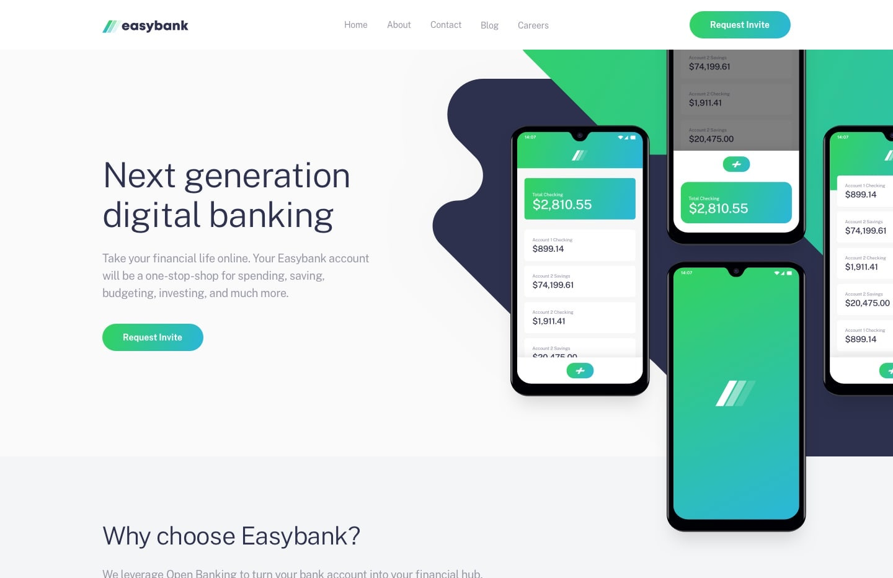

# Frontend Mentor - Easybank landing page solution

This is a solution to the [Easybank landing page challenge on Frontend Mentor](https://www.frontendmentor.io/challenges/easybank-landing-page-WaUhkoDN). Frontend Mentor challenges help you improve your coding skills by building realistic projects.

## Table of contents

- [Overview](#overview)
- [The challenge](#the-challenge)
- [Screenshot](#screenshot)
- [Links](#links)
- [Built with](#built-with)
- [Author](#author)

## Overview

Simple landing page about a digital banking service called Easybank!

### The challenge

Users should be able to:

- View the optimal layout for the site depending on their device's screen size
- See hover states for all interactive elements on the page

### Screenshot

### Links

- [Solution URL](https://your-solution-url.com)
- [Live Site URL](https://easybank-landing-gamma.vercel.app/)
- [Github Repo URL](https://github.com/joacomesa22/easybank-landing)

### Built with

- [React](https://reactjs.org/) - JS library
- [Tailwind](https://tailwindcss.com/) - For styles

## Author

- Website - [joacomesa.com.ar](https://www.joacomesa.com.ar/)
- Frontend Mentor - [@joacomesa22](https://www.frontendmentor.io/profile/yourusername)
